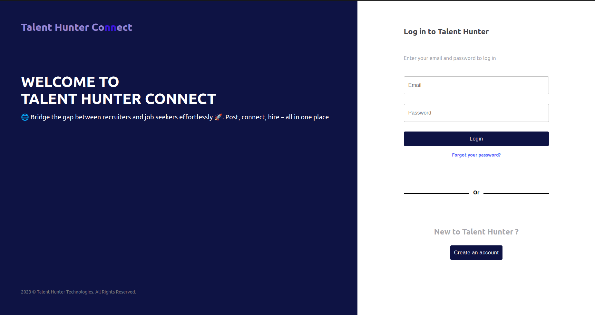

[](https://www.gnu.org/licenses/gpl-3.0)

# Professionnel-Social-Platform

Development of a web application for sharing job offers to connect recruiters and job seekers. Recruiters can post job offers, review profiles of candidates with relevant qualifications, and contact them if necessary.

---

<h3>Screen</h3>



---

Certainly! Here is the entire markdown script:

```markdown
# TalentHunter Application 🎯

## Run Application

1. **Create Docker Container** 🐳

   In the root of our back-end project, find a file named `docker-compose.yml`. Run the following command to start the Docker container:

   ```bash
   docker-compose up -d
   ```

2. **Check Container Status** 🚀

   To check the status of the Docker containers, run:

   ```bash
   docker-compose ps
   ```

3. **Enter Container in Interactive Mode** 🖥️

   Access your container in interactive mode using:

   ```bash
   sudo docker exec -it postgres bash
   ```

4. **Use PostgreSQL** 🐘

   - To use `psql`, run:

     ```bash
     psql -U ayoubkassi
     ```

   - Switch to our database:

     ```sql
     \c talenthunter
     ```

   - Show tables:

     ```sql
     \dt
     ```

## Play with Data 🎲

Now that you're inside the container and connected to the `talenthunter` database, feel free to interact with the data.

## Important Note 📝

Make sure to replace `ayoubkassi` with your actual PostgreSQL username when using `psql`.
```

Feel free to copy and use this script in your README file!


